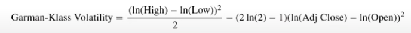
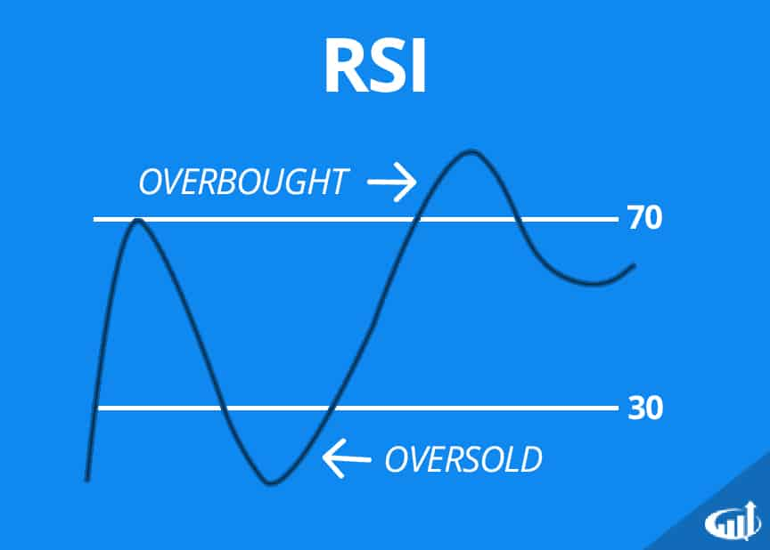

## What this project does

1. Download SP500 stocks prices data
2. Calculate different technical indicators and features for each stock
3. Aggregate on monthly level and filter for each month only top 150 most liquid stocks
4. Calculate monthly returns for different time-horizons to add to features
5. Download Fama-French Factors and calcucalte rolling factor betas for each stock
6. For each month fit a K-means clustering model to group similar assets based on their features
7. For each month select assets based on the cluster and form a protfolio based on Efficient Frontier max sharpe ration portfolio optimizaiton
8. Visualize the portfolio returns and compare to SP500 returns

## German-Klass Volatility

Garman-Klass volatility is a statistical measure that estimates the price volatility of a financial asset by using a security's opening, high, low, and closing prices. It is an extension of simpler methods, aiming for greater accuracy by incorporating intraday price movements and the significant volatility that often occurs at the open and close of a trading period.

## RSI Indicator

The RSI, or Relative Strength Index, is a technical analysis indicator that measures the speed and magnitude of recent price changes to identify overbought or oversold conditions in a stock or market. It is displayed as an oscillator on a scale of 0 to 100, with values above 70 traditionally considered overbought and below 30 considered oversold. Developed by J. Welles Wilder Jr., the RSI helps traders assess bullish and bearish momentum and potential trend reversals by analyzing the ratio of average gains to average losses over a specific number of periods

